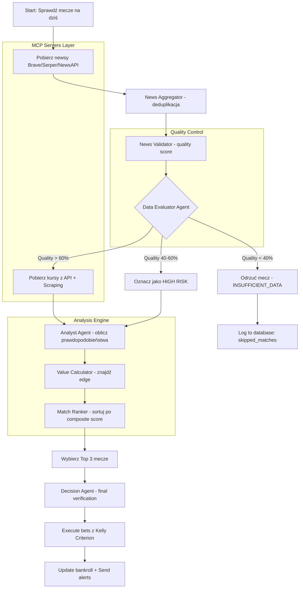

# 1. ARCHITEKTURA SYSTEMU

### 1.1 Diagram Przepływu Danych



### 1.2 Architektura Komponentów

```
┌─────────────────────────────────────────────────────────────────────────────────┐
│                              GRADIO INTERFACE                                    │
│  ┌──────────────┐ ┌──────────────┐ ┌──────────────┐ ┌──────────────┐            │
│  │ Dashboard    │ │ Top 3 Tab   │ │ Live News   │ │ History     │            │
│  └──────────────┘ └──────────────┘ └──────────────┘ └──────────────┘            │
└─────────────────────────────────────────────────────────────────────────────────┘
                                       │
                                       ▼
┌─────────────────────────────────────────────────────────────────────────────────┐
│                           LANGGRAPH ORCHESTRATOR                                 │
│  ┌─────────────┐  ┌─────────────┐  ┌─────────────┐  ┌─────────────┐             │
│  │ Supervisor  │◀─│ NewsAnalyst │──│ DataEvaluator│──│ Analyst    │             │
│  └─────────────┘  └─────────────┘  └─────────────┘  └─────────────┘             │
│         │                                                   │                    │
│         ▼                                                   ▼                    │
│  ┌─────────────┐  ┌─────────────┐  ┌─────────────┐  ┌─────────────┐             │
│  │ MatchRanker │──│ RiskManager │──│DecisionMaker│──│ BettorAgent │             │
│  └─────────────┘  └─────────────┘  └─────────────┘  └─────────────┘             │
└─────────────────────────────────────────────────────────────────────────────────┘
                                       │
                                       ▼
┌─────────────────────────────────────────────────────────────────────────────────┐
│                              MCP SERVERS LAYER                                   │
│  ┌─────────────┐  ┌─────────────┐  ┌─────────────┐  ┌─────────────┐             │
│  │ news_server │  │evaluation_  │  │ odds_server │  │ tennis_     │             │
│  │ (Brave+     │  │server       │  │ (TheOddsAPI │  │ server      │             │
│  │  Serper)    │  │             │  │  + Scraping)│  │             │             │
│  └─────────────┘  └─────────────┘  └─────────────┘  └─────────────┘             │
│  ┌─────────────┐  ┌─────────────┐  ┌─────────────┐                              │
│  │ basketball_ │  │ alerts_     │  │ pl_bookies_ │                              │
│  │ server      │  │ server      │  │ scraper     │                              │
│  └─────────────┘  └─────────────┘  └─────────────┘                              │
└─────────────────────────────────────────────────────────────────────────────────┘
                                       │
                                       ▼
┌─────────────────────────────────────────────────────────────────────────────────┐
│                              DATA SOURCES                                        │
│  [Brave Search] [Serper] [NewsAPI] [The Odds API] [api-tennis] [BetsAPI]        │
│  [Sofascore Scraping] [Fortuna Scraping] [STS Scraping] [Betclic Scraping]      │
└─────────────────────────────────────────────────────────────────────────────────┘
```
