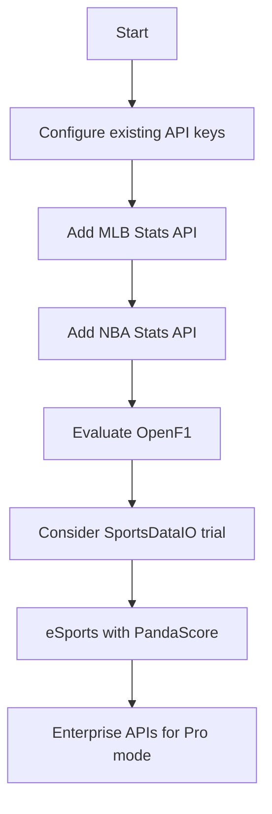

# Sports Data APIs Research for NEXUS AI

**Date:** 2026-01-26  
**Purpose:** Research and document available APIs for obtaining sports information

---

## Table of Contents

1. [Executive Summary](#executive-summary)
2. [Currently Implemented APIs](#currently-implemented-apis)
3. [Free Sports Data APIs](#free-sports-data-apis)
4. [Freemium Sports Data APIs](#freemium-sports-data-apis)
5. [Paid/Professional APIs](#paidprofessional-apis)
6. [Sports-Specific APIs](#sports-specific-apis)
7. [Odds & Betting APIs](#odds--betting-apis)
8. [News & Media APIs](#news--media-apis)
9. [Scraping Alternatives](#scraping-alternatives)
10. [Recommendations](#recommendations)

---

## Executive Summary

This research documents **50+ sports data APIs** categorized by pricing model, sport coverage, and data types. The goal is to provide NEXUS AI with comprehensive access to sports information for betting analysis.

**Key Findings:**
- **Free APIs available:** TheSportsDB, OpenDota, Football-Data.org
- **Best freemium options:** API-Football, The Odds API, SportRadar
- **Sports coverage varies significantly** - Tennis/Basketball have most options
- **Rate limits are the main constraint** on free tiers

---

## Currently Implemented APIs

Based on codebase analysis, NEXUS AI currently uses:

| API | Type | Status | Sport Coverage |
|-----|------|--------|----------------|
| TheSportsDB | Free | ✅ Active | Tennis, Basketball |
| The Odds API | Freemium | ⚠️ Config needed | Tennis, Basketball, Ice Hockey |
| API-Tennis | Paid | ⚠️ Config needed | Tennis (ATP/WTA) |
| Bets API | Paid | ⚠️ Config needed | Basketball (NBA, EuroLeague) |
| Sofascore | Scraping | ✅ Active | Multiple sports |
| Flashscore | Scraping | ✅ Active | Multiple sports |
| Brave Search | Freemium | ⚠️ Config needed | News |
| Serper | Freemium | ⚠️ Config needed | News |
| NewsAPI | Freemium | ⚠️ Config needed | News |

---

## Free Sports Data APIs

### 1. TheSportsDB
**Website:** https://www.thesportsdb.com  
**Status:** ✅ Already implemented

| Feature | Details |
|---------|---------|
| Base URL | `https://www.thesportsdb.com/api/v1/json` |
| API Key | Public key: "3" (free tier) |
| Rate Limit | ~100 requests/minute |
| Sports | Tennis, Basketball, Football, Baseball, Hockey |
| Data | Fixtures, Teams, Players, Events, League tables |
| **Free Tier** | Unlimited with public key (basic data only) |

**Endpoints:**
- `/eventsday.php?d={date}&s={sport}` - Events by date
- `/eventsseason.php?id={league}&s={season}` - League events
- `/lookupteam.php?id={team_id}` - Team details
- `/lookuptable.php?l={league}&s={season}` - Standings
- `/searchteams.php?t={name}` - Team search
- `/searchplayers.php?p={name}` - Player search

**Integration Code:** [`data/apis/thesportsdb_client.py`](data/apis/thesportsdb_client.py)

---

### 2. OpenDota
**Website:** https://www.opendota.com

| Feature | Details |
|---------|---------|
| Base URL | `https://api.opendota.com/api` |
| API Key | Optional (for higher limits) |
| Rate Limit | Free: 50 req/min, Auth: 300 req/min |
| Sports | eSports (Dota 2) |
| Data | Matches, Players, Pro matches, Rankings |

**Endpoints:**
- `/proMatches` - Professional matches
- `/matches/{match_id}` - Match details
- `/players/{account_id}` - Player stats
- `/rankings` - Player rankings

**Best for:** eSports betting analysis

---

### 3. Football-Data.org
**Website:** https://www.football-data.org

| Feature | Details |
|---------|---------|
| Base URL | `https://api.football-data.org/v4` |
| API Key | Required (free API key available) |
| Rate Limit | 10 requests/minute (free), 100/min (paid) |
| Sports | Football (Soccer) |
| Data | Fixtures, Results, Standings, Teams |

**Free Tier:**
- 10 calls/minute
- Competitions: PL, LaLiga, Serie A, Bundesliga, CL, EL
- Basic match data

**Note:** Could be useful for multi-sport betting platform

---

### 4. Decathlon API (TheSportsDB alternative)
**Website:** https://developers.decathlon.com

| Feature | Details |
|---------|---------|
| Base URL | `https://api.decathlon.com` |
| API Key | Required (free tier) |
| Rate Limit | 100 requests/hour |
| Sports | Multiple (running, fitness, etc.) |
| Data | Products, Activities |

**Note:** More for sports products than betting

---

### 5. ESPN API (Unofficial)
**Website:** Various npm packages available

| Feature | Details |
|---------|---------|
| Type | Unofficial/Scraping |
| Sports | NFL, NBA, MLB, Soccer |
| Data | Scores, Schedules, News |

**Implementation:** Requires scraping or unofficial npm packages

**Note:** Not officially supported, may break

---

### 6. Cricket API Options

#### a) CricAPI
**Website:** https://cricapi.com

| Feature | Details |
|---------|---------|
| Base URL | `https://api.cricapi.com/v1` |
| API Key | Required (free tier available) |
| Rate Limit | Limited on free tier |
| Sports | Cricket |
| Data | Matches, Scores, Player info |

**Endpoints:**
- `/matches` - Upcoming matches
- `/cricketInfo` - Match details
- `/fantasySummary` - Fantasy stats

#### b) SportMonks Cricket
**Website:** https://www.sportmonks.com/cricket-api

| Feature | Details |
|---------|---------|
| Base URL | `https://cricket.sportmonks.com/api/v2` |
| API Key | Required |
| Rate Limit | Varies by plan |
| Sports | Cricket |

**Free Tier:** Limited to 50 calls/month

---

### 7. Rugby Data APIs

#### a) Rugby Data API
**Website:** https://rugbydata.co.uk

| Feature | Details |
|---------|---------|
| Type | Free API |
| Sports | Rugby Union, Rugby League |
| Data | Fixtures, Results, Tables |

#### b) API-Football (also covers Rugby)
**Website:** https://www.api-football.com

| Feature | Details |
|---------|---------|
| Base URL | `https://v1.rugby.api-sports.io` |
| API Key | Required |
| Rate Limit | 100 requests/day (free) |
| Sports | Rugby Union, Rugby League |

---

### 8. Baseball APIs

#### a. MLB Stats API (Official)
**Website:** https://statsapi.mlb.com

| Feature | Details |
|---------|---------|
| Base URL | `https://statsapi.mlb.com/api/v1` |
| API Key | None required |
| Rate Limit | Not specified (respectful usage) |
| Sports | MLB |
| Data | Full game data, stats, schedules |

**Endpoints:**
- `/schedule` - Game schedule
- `/game/{game_pk}/boxscore` - Box scores
- `/teams` - Team info

**Status:** ✅ **HIGHLY RECOMMENDED** - Official, free, comprehensive

#### b. Baseball-Reference (Scraping)
**Website:** https://www.baseball-reference.com

| Feature | Details |
|---------|---------|
| Type | Web scraping |
| Data | Historical stats, schedules, results |

**Implementation:** BeautifulSoup or similar

---

### 9. American Football APIs

#### a. NFL Data API (Official)
**Website:** https://sportsdata.io

| Feature | Details |
|---------|---------|
| Base URL | `https://api.sportsdata.io/v3/nfl` |
| API Key | Required |
| Rate Limit | Varies by plan |
| Sports | NFL |

**Free Tier:** Limited during preseason only

#### b. College Football Data API
**Website:** https://collegefootballdata.com

| Feature | Details |
|---------|---------|
| Base URL | `https://api.collegefootballdata.com/api/v4` |
| API Key | Required (free) |
| Rate Limit | 30 requests/minute |
| Sports | College Football |
| Data | Games, Teams, Rankings, Betting lines |

**Status:** ✅ **RECOMMENDED** - Good free tier

---

### 10. Hockey APIs

#### a. NHL API (Unofficial but functional)
**Website:** https://github.com/erindoms/nhl-api

| Feature | Details |
|---------|---------|
| Base URL | `https://api-web.nhl.com` |
| API Key | None required |
| Rate Limit | Respectful usage |
| Sports | NHL |
| Data | Schedules, scores, stats |

**Status:** ✅ **RECOMMENDED** - Unofficial but reliable

#### b. IIHF API (International Hockey)
**Website:** https://www.worldhockey.net

| Feature | Details |
|---------|---------|
| Type | Data access available |
| Sports | International Ice Hockey |

---

### 11. Volleyball APIs

#### a. World Volleyball Network
**Website:** https://www.volleyballworld.com

| Feature | Details |
|---------|---------|
| Type | Official data |
| Sports | Volleyball |

**Status:** Contact for API access

#### b. Volleyverse
**Website:** https://volleyverse.com

| Feature | Details |
|---------|---------|
| Type | Data platform |
| Sports | Volleyball |

---

### 12. Golf APIs

#### a. Golf API (SportRadar)
**Website:** https://www.sportradar.com

| Feature | Details |
|---------|---------|
| Type | Official API |
| Sports | PGA, European Tour |

**Note:** Enterprise-level pricing

#### b. The Golf API
**Website:** https://thegolfapi.com

| Feature | Details |
|---------|---------|
| Base URL | `https://api.thegolfapi.com` |
| API Key | Required |
| Rate Limit | Varies |
| Sports | Golf |

---

### 13. eSports APIs

#### a. PandaScore
**Website:** https://pandascore.co

| Feature | Details |
|---------|---------|
| Base URL | `https://api.pandascore.co/v4` |
| API Key | Required (free tier) |
| Rate Limit | 1000 requests/month (free) |
| eSports | LoL, Dota 2, CS:GO, Valorant, Overwatch |

**Free Tier:**
- 1000 calls/month
- Access to matches, tournaments, players
- Real-time data (limited)

**Status:** ✅ **HIGHLY RECOMMENDED** for eSports

#### b. Abios Gaming (G2A)
**Website:** https://abiosgaming.com

| Feature | Details |
|---------|---------|
| Type | Official eSports data |
| eSports | Multiple games |

**Note:** Enterprise pricing

#### c. Liquipedia (Scraping)
**Website:** https://liquipedia.net

| Feature | Details |
|---------|---------|
| Type | Wiki scraping |
| eSports | All major games |

---

### 14. F1/Motor Racing APIs

#### a. OpenF1
**Website:** https://openf1.org

| Feature | Details |
|---------|---------|
| Base URL | `https://api.openf1.org/v1` |
| API Key | None required |
| Rate Limit | Respectful usage |
| Sports | F1 |
| Data | Session data, lap times, telemetry |

**Status:** ✅ **HIGHLY RECOMMENDED** - Excellent free API

#### b. Ergast Developer API (F1 History)
**Website:** http://ergast.com/mrd

| Feature | Details |
|---------|---------|
| Base URL | `http://ergast.com/api/f1` |
| API Key | None required |
| Rate Limit | Respectful usage |
| Sports | F1 (historical + current) |
| Data | Race results, qualifying, standings |

**Status:** ✅ **RECOMMENDED** - Historical F1 data

#### c. SportRadar F1
**Website:** https://www.sportradar.com

| Feature | Details |
|---------|---------|
| Type | Official real-time API |
| Sports | F1, MotoGP |

**Note:** Enterprise pricing

---

### 15. Cycling APIs

#### a. ProCyclingStats
**Website:** https://procyclingstats.com

| Feature | Details |
|---------|---------|
| Type | Data platform |
| Sports | Road Cycling, MTB, Cyclocross |

**Status:** Scraping available

#### b. Cycling API (Strava alternative)
**Website:** https://developers.strava.com

| Feature | Details |
|---------|---------|
| Base URL | `https://www.strava.com/api/v3` |
| API Key | Required |
| Rate Limit | 100 requests/15 min, 1000/day |
| Sports | Cycling, Running, Other activities |

**Note:** More for activity tracking than races

---

## Freemium Sports Data APIs

### 1. API-Football (RapidAPI)
**Website:** https://api-football.com

| Feature | Details |
|---------|---------|
| Base URL | `https://v1.football.api-sports.io` |
| API Key | Required (RapidAPI) |
| Rate Limit | 100 requests/day (free), 1000+/day (paid) |
| Sports | Football (Soccer), Basketball, Tennis, Rugby, Baseball |
| Data | Fixtures, Results, Statistics, Odds |

**Free Tier:**
- 10 calls/minute
- 100 requests/day
- Historical data (last 7 days)
- 150+ leagues

**Pricing:**
- Free: $0/month
- Starter: $30/month (5000 calls)
- Pro: $80/month (20000 calls)
- Enterprise: Custom

**Implementation:**
```python
# config/free_apis.py already has configuration
API_SPORTS_CONFIG = {
    "basketball": {
        "base_url": "https://v1.basketball.api-sports.io",
        "enabled": False,  # Requires API key
        "daily_limit": 100,
    },
    "tennis": {
        "base_url": "https://v1.tennis.api-sports.io", 
        "enabled": False,
        "daily_limit": 100,
    }
}
```

**Status:** ⚠️ **PARTIALLY CONFIGURED** - Need to add API keys to .env

---

### 2. The Odds API
**Website:** https://the-odds-api.com

| Feature | Details |
|---------|---------|
| Base URL | `https://api.the-odds-api.com/v4` |
| API Key | Required |
| Rate Limit | 500 requests/month (free) |
| Sports | 30+ sports |
| Data | Odds from 40+ bookmakers |

**Free Tier:**
- 500 requests/month
- 3 bookmakers per market (free)
- 3 regions (eu, us, uk, au)

**Pricing:**
- Free: $0/month (500 req)
- $50/month (unlimited)
- Enterprise: Custom

**Data Types:**
- H2H (Moneyline)
- Spreads (Handicap)
- Totals (Over/Under)
- Props
- Futures

**Implementation:** [`data/odds/odds_api_client.py`](data/odds/odds_api_client.py)

**Status:** ✅ **IMPLEMENTED** - Configure ODDS_API_KEY in .env

---

### 3. SportRadar
**Website:** https://developer.sportradar.com

| Feature | Details |
|---------|---------|
| Base URL | `https://api.sportradar.com` |
| API Key | Required |
| Rate Limit | Varies by plan |
| Sports | 30+ sports |
| Data | Live stats, historical, betting odds |

**Pricing:**
- Free trial available
- Enterprise pricing ($$$$)
- Different packages per sport

**Coverage:**
- NFL, NBA, MLB, NHL (US sports)
- Soccer (Premier League, LaLiga, etc.)
- Cricket, Rugby, Tennis

**Note:** Industry standard for professional betting

---

### 4. SportMonks
**Website:** https://www.sportmonks.com

| Feature | Details |
|---------|---------|
| Base URL | `https://cricket.sportmonks.com/api/v2` |
| API Key | Required |
| Rate Limit | Varies by plan |
| Sports | Football, Cricket, Rugby |

**Pricing:**
- Free: Limited
- Core: $25/month
- Pro: $99/month
- Enterprise: Custom

**Football Coverage:**
- 1500+ leagues
- Live scores
- Statistics

---

### 5. Football-Data.org (Paid Tier)
**Website:** https://www.football-data.org

| Feature | Details |
|---------|---------|
| Base URL | `https://api.football-data.org/v4` |
| API Key | Required |
| Rate Limit | 100 requests/minute (paid) |
| Sports | Football (Soccer) |

**Pricing:**
- Free: 10 req/min
- Starter: $15/month (100 req/min)
- Professional: $30/month (100 req/min)
- Enterprise: Custom

**Data:**
- Live scores
- Fixtures
- Statistics
- Betting odds (paid)

---

### 6. XML Soccer (Deprecated/Merged)
**Note:** Many users migrated to API-Football

---

### 7. Enetpulse
**Website:** https://www.enetpulse.com

| Feature | Details |
|---------|---------|
| Type | Sports data provider |
| Sports | Multiple |
| Data | Live scores, statistics |

**Note:** Enterprise-level pricing

---

### 8. Stats Perform
**Website:** https://www.statsperform.com

| Feature | Details |
|---------|---------|
| Type | Professional sports data |
| Sports | All major sports |
| Data | Historical, real-time, AI predictions |

**Note:** Enterprise pricing, industry leader

---

## Paid/Professional APIs

### 1. Betgenius (Genius Sports)
**Website:** https://www.betgenius.com

| Feature | Details |
|---------|---------|
| Type | Official betting data |
| Sports | Football, Basketball, Tennis, more |
| Data | Official odds, live data |

**Note:** Official sportsbook data provider

---

### 2. Sportradar (Integrity Services)
**Website:** https://www.sportradar.com

| Feature | Details |
|---------|---------|
| Type | Official data + integrity |
| Sports | Global |
| Data | Live feeds, betting odds, fraud detection |

**Pricing:** Enterprise ($$$$)

---

### 3. Genius Sports
**Website:** https://www.geniussports.com

| Feature | Details |
|---------|---------|
| Type | Official sports data |
| Sports | Football, Basketball, more |

---

### 4. BetMakers
**Website:** https://www.betmakers.com

| Feature | Details |
|---------|---------|
| Type | Horse racing data |
| Sports | Horse Racing |

---

### 5. Racing Post API
**Website:** https://www.racingpost.com

| Feature | Details |
|---------|---------|
| Type | Horse racing data |
| Sports | Horse Racing |

---

### 6. Timeform
**Website:** https://timeform.com

| Feature | Details |
|---------|---------|
| Type | Horse racing ratings |
| Sports | Horse Racing |

---

### 7. SportsDataIO
**Website:** https://sportsdata.io

| Feature | Details |
|---------|---------|
| Base URL | `https://api.sportsdata.io/v3` |
| API Key | Required |
| Rate Limit | Varies by plan |
| Sports | NFL, NBA, MLB, NHL, PGA, CFL |

**Pricing:**
- Free trial
- Various tiers per sport
- Real-time updates (additional cost)

**Coverage:**
- NBA: Full game data
- NFL: Play-by-play
- MLB: Statcast
- Golf: Tour data

**Status:** ⚠️ **NOT IMPLEMENTED** - Could add for US sports

---

## Sports-Specific APIs

### Tennis APIs

#### a. API-Tennis (Already implemented)
**Website:** https://api-tennis.com

| Feature | Details |
|---------|---------|
| Base URL | `https://api-tennis.com/tennis` |
| API Key | Required (X-RapidAPI-Key) |
| Rate Limit | 500 requests/month (free) |
| Sports | Tennis (ATP, WTA, ITF) |

**Implementation:** [`data/tennis/api_tennis_client.py`](data/tennis/api_tennis_client.py)

**Status:** ⚠️ **CONFIGURE API_TENNIS_KEY in .env**

#### b. Tennis Data API (Unofficial)
**Source:** Various scraping solutions

#### c. LiveScore API (Unofficial)
**Website:** https://livescore.com

---

### Basketball APIs

#### a. Bets API (Already implemented)
**Website:** https://the-bets-api.com

**Implementation:** [`data/basketball/bets_api_client.py`](data/basketball/bets_api_client.py)

**Status:** ⚠️ **CONFIGURE BETS_API_KEY in .env**

#### b. API-Football Basketball
**Endpoint:** `https://v1.basketball.api-sports.io`

#### c. NBA Stats API
**Website:** https://stats.nba.com

| Feature | Details |
|---------|---------|
| Base URL | `https://stats.nba.com/stats` |
| API Key | None (requires specific headers) |
| Rate Limit | Respectful usage |
| Sports | NBA |
| Data | Full player/team statistics |

**Note:** Requires specific User-Agent and Referer headers

**Status:** ✅ **RECOMMENDED** - Official, free

#### d. EuroLeague API
**Website:** https://www.euroleague.net

| Feature | Details |
|---------|---------|
| Type | Official data |
| Sports | EuroLeague Basketball |

**Note:** Contact for API access

---

### Greyhound Racing APIs

#### a. GBGB (Greyhound Board of GB)
**Website:** https://www.gbgb.org.uk

| Feature | Details |
|---------|---------|
| Type | Official results |
| Sports | Greyhound Racing (UK) |

#### b. Racing Post Greyhounds
**Website:** https://www.racingpost.com

---

### Handball APIs

#### a. EHF (European Handball Federation)
**Website:** https://www.eurohandball.com

| Feature | Details |
|---------|---------|
| Type | Official data |
| Sports | Handball (European competitions) |

**Status:** Contact for API access

#### b. IHF (International Handball Federation)
**Website:** https://www.ihf.info

| Feature | Details |
|---------|---------|
| Type | Official data |
| Sports | International Handball |

---

### Table Tennis APIs

#### a. ITTF API
**Website:** https://ittf.com

| Feature | Details |
|---------|---------|
| Type | Official data |
| Sports | Table Tennis |

#### b. Smash API (Table Tennis)
**Website:** https://api.smash.gg

| Feature | Details |
|---------|---------|
| Base URL | `https://api.smash.gg` |
| API Key | Required |
| Sports | eSports, Table Tennis |

---

## Odds & Betting APIs

### 1. The Odds API (Already Implemented)
See Freemium section above

### 2. Oddsmatcher APIs
Various services providing odds comparison

### 3. Betting Exchange APIs

#### a. Betfair Exchange API
**Website:** https://developer.betfair.com

| Feature | Details |
|---------|---------|
| Base URL | `https://api.betfair.com/exchange/betting` |
| API Key | Required |
| Rate Limit | Varies by plan |
| Sports | Global |
| Data | Exchange odds, market data |

**Note:** Requires Betfair account, costs involved

#### b. Smarkets API
**Website:** https://smarkets.com

| Feature | Details |
|---------|---------|
| Type | Exchange API |
| Sports | Various |

---

### 4. Bookmaker APIs

#### a. Pinnacle API
**Website:** https://www.pinnacle.com

| Feature | Details |
|---------|---------|
| Type | Bookmaker API |
| Sports | Global |

**Note:** Enterprise pricing

#### b. Bet365 API (Unofficial)
**Status:** Not available officially

---

## News & Media APIs

### 1. Brave Search (Already Implemented)
**Website:** https://brave.com/search/api

**Implementation:** [`data/news/aggregator.py`](data/news/aggregator.py)

**Status:** ⚠️ **CONFIGURE BRAVE_API_KEY in .env**

### 2. Serper (Already Implemented)
**Website:** https://serper.dev

**Implementation:** [`data/news/aggregator.py`](data/news/aggregator.py)

**Status:** ⚠️ **CONFIGURE SERPER_API_KEY in .env**

### 3. NewsAPI
**Website:** https://newsapi.org

| Feature | Details |
|---------|---------|
| Base URL | `https://newsapi.org/v2` |
| API Key | Required |
| Rate Limit | 100 requests/day (free), 1000+ (paid) |
| Sources | 80,000+ news sources |

**Pricing:**
- Free: $0/month (100 req/day)
- Developer: $40/month (500 req/day)
- NewsAPI+: $400/month

**Status:** ⚠️ **CONFIGURE NEWSAPI_KEY in .env**

### 4. Bing News Search (Azure)
**Website:** https://azure.microsoft.com/services/cognitive-services

| Feature | Details |
|---------|---------|
| Base URL | `https://bing.microsoft.com/v7.0/news/search` |
| API Key | Required (Azure) |
| Rate Limit | 1000 searches/month (free) |

### 5. GNews
**Website:** https://gnews.io

| Feature | Details |
|---------|---------|
| Base URL | `https://gnews.io/api/v4` |
| API Key | Required |
| Rate Limit | 100 requests/day (free) |
| Sources | News articles |

**Pricing:**
- Free: $0/month (100 req/day)
- $49/month (unlimited)

### 6. Currents API
**Website:** https://currentsapi.services

| Feature | Details |
|---------|---------|
| Base URL | `https://api.currentsapi.services/v1` |
| API Key | Required |
| Rate Limit | 600 requests/day (free) |
| Sources | News articles |

**Free Tier:** 600 requests/day

### 7. NewsData.io
**Website:** https://newsdata.io

| Feature | Details |
|---------|---------|
| Base URL | `https://newsdata.io/api/1` |
| API Key | Required |
| Rate Limit | 10 requests/minute (free) |
| Sources | Global news |

**Pricing:**
- Free: $0/month
- Basic: $49/month
- Professional: $99/month

---

## Scraping Alternatives

### 1. Sofascore (Already Implemented)
**Website:** https://sofascore.com

**Implementation:** `config/free_apis.py` - SOFASCORE_CONFIG

**Status:** ✅ **IMPLEMENTED** - Rate limit: 2 req/s

### 2. Flashscore (Already Implemented)
**Website:** https://flashscore.com

**Implementation:** [`data/scrapers/flashscore_scraper.py`](data/scrapers/flashscore_scraper.py)

**Status:** ✅ **IMPLEMENTED** - Requires Playwright

### 3. LiveScore
**Website:** https://livescore.com

| Feature | Details |
|---------|---------|
| Type | Web scraping |
| Sports | Global |

**Implementation:** BeautifulSoup/Playwright

### 4. ESPN Scraping
**Website:** https://espn.com

**Implementation:** Various scraping libraries

### 5. BBC Sport
**Website:** https://bbc.com/sport

**Implementation:** Web scraping

### 6. Sky Sports
**Website:** https://skysports.com

**Implementation:** Web scraping

### 7. Transfermarkt
**Website:** https://transfermarkt.com

| Feature | Details |
|---------|---------|
| Type | Football data scraping |
| Sports | Football (Soccer) |
| Data | Transfers, valuations, stats |

**Note:** Strict anti-scraping measures

---

## Recommendations

### Immediate Actions

1. **Configure Existing APIs** (Priority: High)
   ```
   Add to .env:
   - ODDS_API_KEY (The Odds API)
   - API_TENNIS_KEY (API-Tennis)
   - BETS_API_KEY (Bets API)
   - BRAVE_API_KEY
   - SERPER_API_KEY
   - NEWSAPI_KEY
   ```

2. **Add MLB Stats API** (Priority: Medium)
   - Free, official, comprehensive
   - Easy integration
   - Adds baseball coverage

3. **Add NBA Stats API** (Priority: Medium)
   - Free, official
   - Comprehensive statistics
   - Add to basketball models

### Medium Priority

4. **Add OpenF1 API** (Priority: Medium)
   - Excellent for F1 betting
   - Free, real-time data
   - Standalone sport

5. **Add College Football Data API** (Priority: Low)
   - Good free tier
   - American football coverage

6. **Add PandaScore for eSports** (Priority: Low)
   - Good free tier
   - Growing market

### High Value Additions

7. **SportsDataIO Trial**
   - Evaluate for US sports
   - Compare with current coverage

8. **SportRadar Evaluation**
   - Industry standard
   - Consider for Pro mode

### Implementation Roadmap



### API Priority Matrix

| API | Cost | Value | Effort | Priority |
|-----|------|-------|--------|----------|
| The Odds API | Freemium | High | Low | 1 |
| API-Tennis | Freemium | High | Low | 1 |
| MLB Stats | Free | Medium | Low | 2 |
| NBA Stats | Free | Medium | Low | 2 |
| OpenF1 | Free | Medium | Low | 3 |
| PandaScore | Freemium | Medium | Medium | 3 |
| SportsDataIO | Paid | High | Medium | 4 |
| SportRadar | Paid | High | Medium | 5 |

---

## Environment Configuration

Update `.env` with:

```bash
# === SPORTS DATA APIS ===
ODDS_API_KEY=your_odds_api_key          # https://the-odds-api.com
API_TENNIS_KEY=your_api_tennis_key       # https://api-tennis.com (RapidAPI)
BETS_API_KEY=your_bets_api_key           # https://the-bets-api.com
API_SPORTS_BASKETBALL_KEY=your_key       # https://api-football.com (RapidAPI)
API_SPORTS_TENNIS_KEY=your_key           # https://api-football.com (RapidAPI)

# === NEWS APIS ===
BRAVE_API_KEY=your_brave_key             # https://brave.com/search/api
SERPER_API_KEY=your_serper_key           # https://serper.dev
NEWSAPI_KEY=your_newsapi_key             # https://newsapi.org
```

---

## References

### Official Documentation
- TheSportsDB: https://www.thesportsdb.com/api.php
- The Odds API: https://the-odds-api.com/docs/v4
- API-Football: https://www.api-football.com/documentation
- MLB Stats: https://statsapi.mlb.com/docs
- OpenF1: https://openf1.org

### NPM/JavaScript Alternatives
- https://www.npmjs.com/package/sportapi
- https://www.npmjs.com/package/sportmonks
- https://www.npmjs.com/package/odds-api

### Related Projects
- https://github.com/datasets/olympic-games
- https://github.com/odota/mobile-client-legacy
- https://github.com/d2school/espn-api

---

**Document Version:** 1.0  
**Last Updated:** 2026-01-26  
**Author:** NEXUS AI Research
